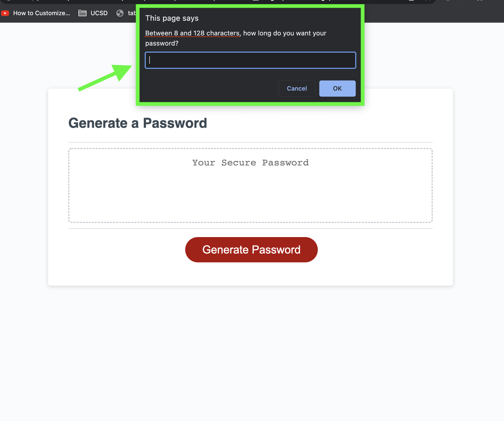

Do you need a new password?

1. Click the Generate Password button to generate a password.

2. Between 8 and 128 characters, choose the length of your desired password.

3. Through the prompts, choose if you want Lower Case, Upper Case, Numbers, and/or Special Characters.

    (3.1) 

    (3.2)

    (3.3)

    (3.4)

4. After you have made all your choices through the prompts your new password will generate in the text box.

GitHub Link: https://github.com/sameersamuel/module-03_pw-gen
